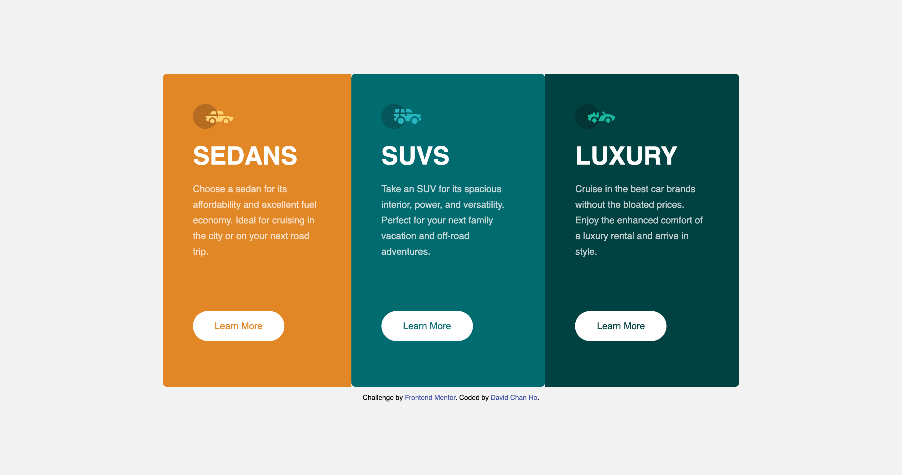
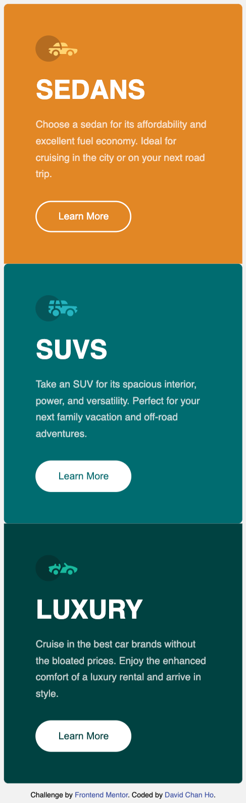
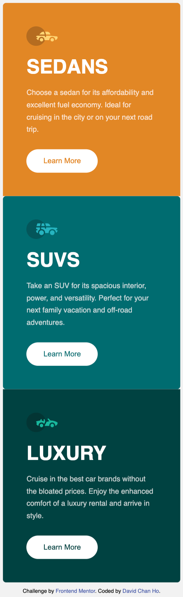

# Frontend Mentor - 3-column preview card component solution

This is a solution to the [3-column preview card component challenge on Frontend Mentor](https://www.frontendmentor.io/challenges/3column-preview-card-component-pH92eAR2-). Frontend Mentor challenges help you improve your coding skills by building realistic projects.

## Table of contents

- [Frontend Mentor - 3-column preview card component solution](#frontend-mentor---3-column-preview-card-component-solution)
  - [Table of contents](#table-of-contents)
  - [Overview](#overview)
    - [The challenge](#the-challenge)
    - [Screenshot](#screenshot)
    - [Links](#links)
  - [My process](#my-process)
    - [Built with](#built-with)
    - [What I learned](#what-i-learned)
    - [Continued development](#continued-development)
    - [Useful resources](#useful-resources)
  - [Author](#author)
  - [Acknowledgments](#acknowledgments)

**Note: Delete this note and update the table of contents based on what sections you keep.**

## Overview

### The challenge

Users should be able to:

- View the optimal layout depending on their device's screen size
- See hover states for interactive elements

### Screenshot

### Links

- Solution URL: [solution](https://www.frontendmentor.io/solutions/mobile-first-nextjs-scss-flexbox-1hXgyPFe4)
- Live Site URL: [vercel](https://three-preview-card.vercel.app/)

## My process

### Built with

- Semantic HTML5 markup
- Flexbox
- Mobile-first workflow
- [React](https://reactjs.org/) - JS library
- [Next.js](https://nextjs.org/) - React framework
- [SCSS](https://sass-lang.com/) - For styles

### What I learned

I further developed my understanding of media queries and the use of rem.
I incorporated font faces to import font types in react.
I became more used to scss @forward and @use. Other in the slack community have trouble with @forward and @use, inspiring my article in this subject.

### Continued development

I will further my knowledge in responsive design by incorporating multiple media queries in more challenging project.

### Useful resources  

- [font-family](https://developer.mozilla.org/en-US/docs/Web/CSS/@font-face)
- [@use](https://www.youtube.com/watch?v=CR-a8upNjJ0&ab_channel=KevinPowell)

## Author

- Website - [David Chan Ho](https://www.davidchanho.com)
- Frontend Mentor - [@davidchanho](https://www.frontendmentor.io/profile/davidchanho)

## Acknowledgments

To those who inspired me to write my article.
